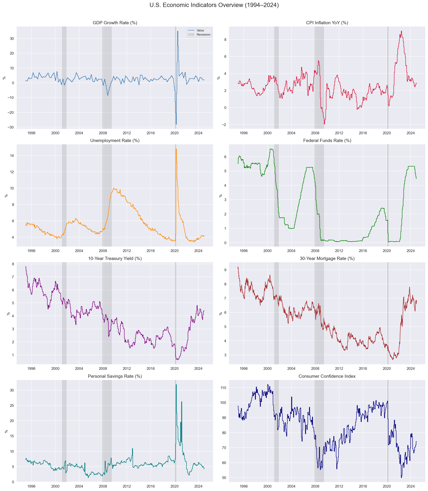
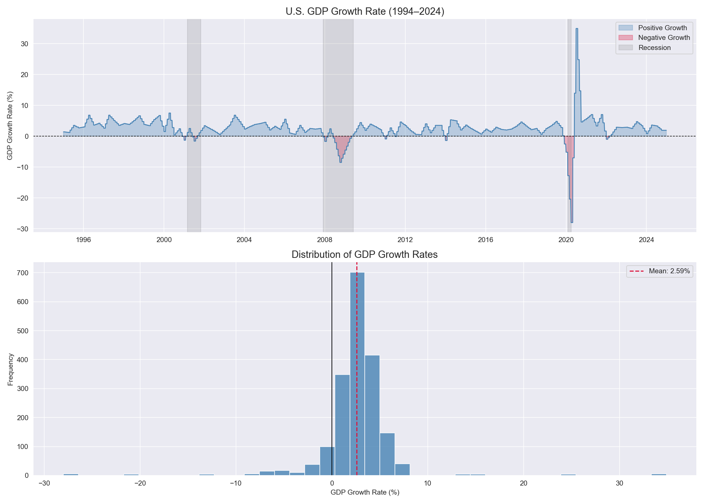
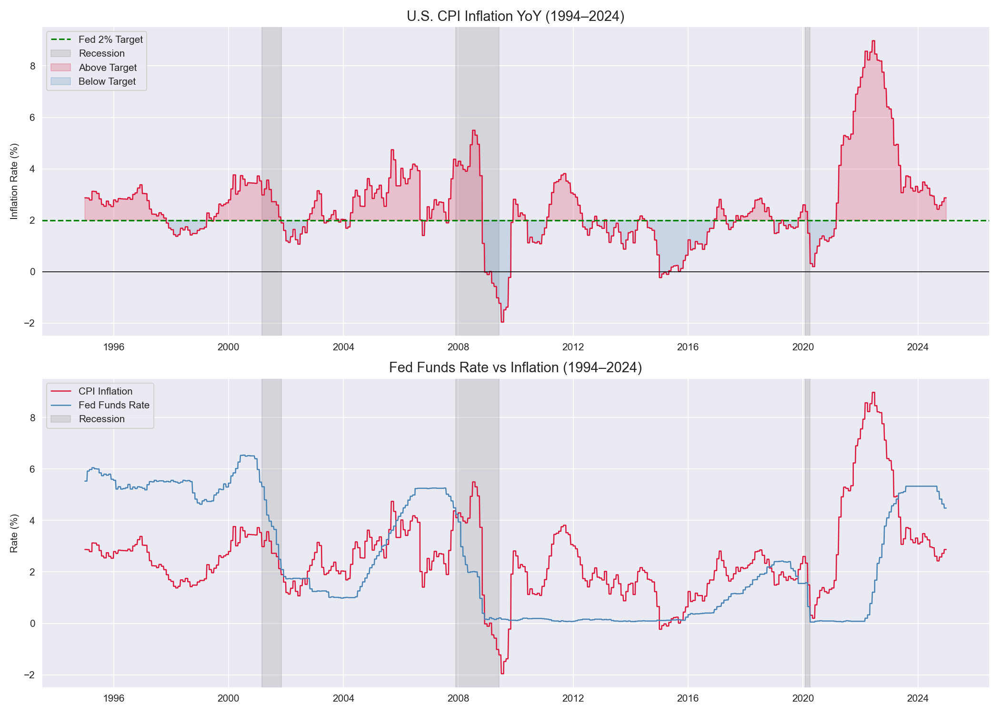
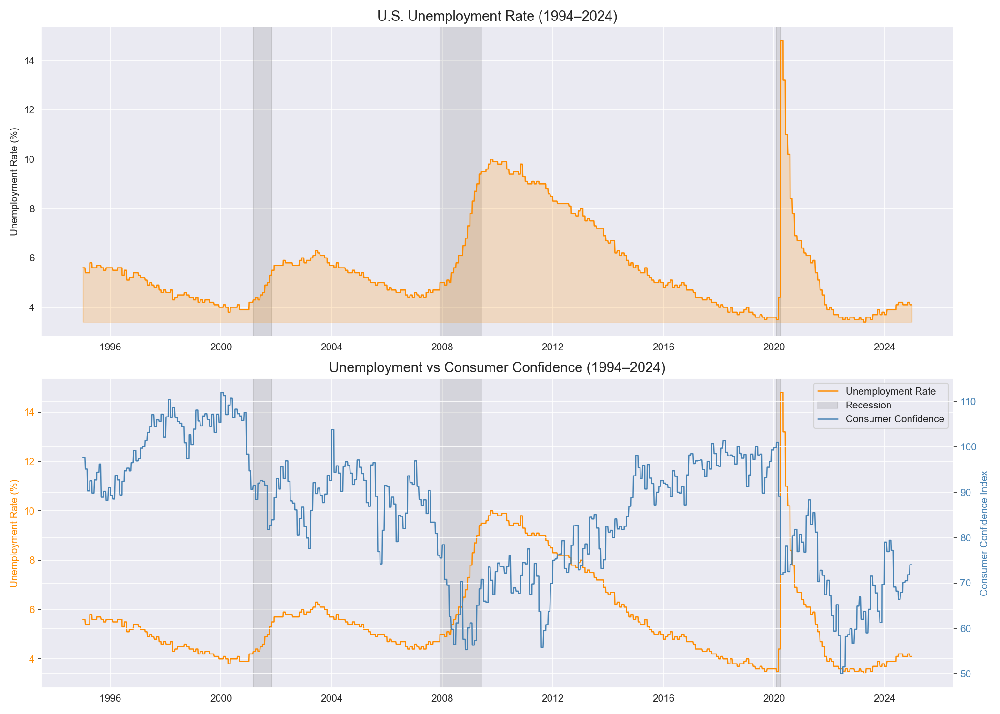
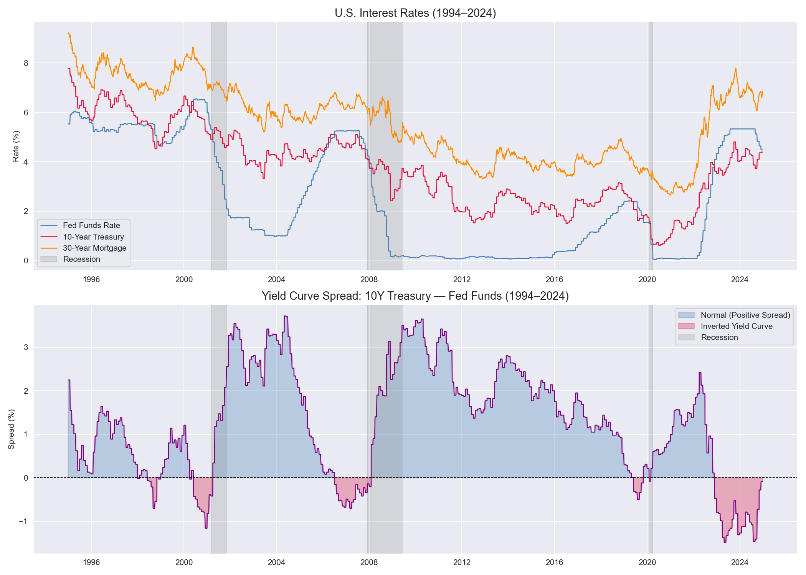
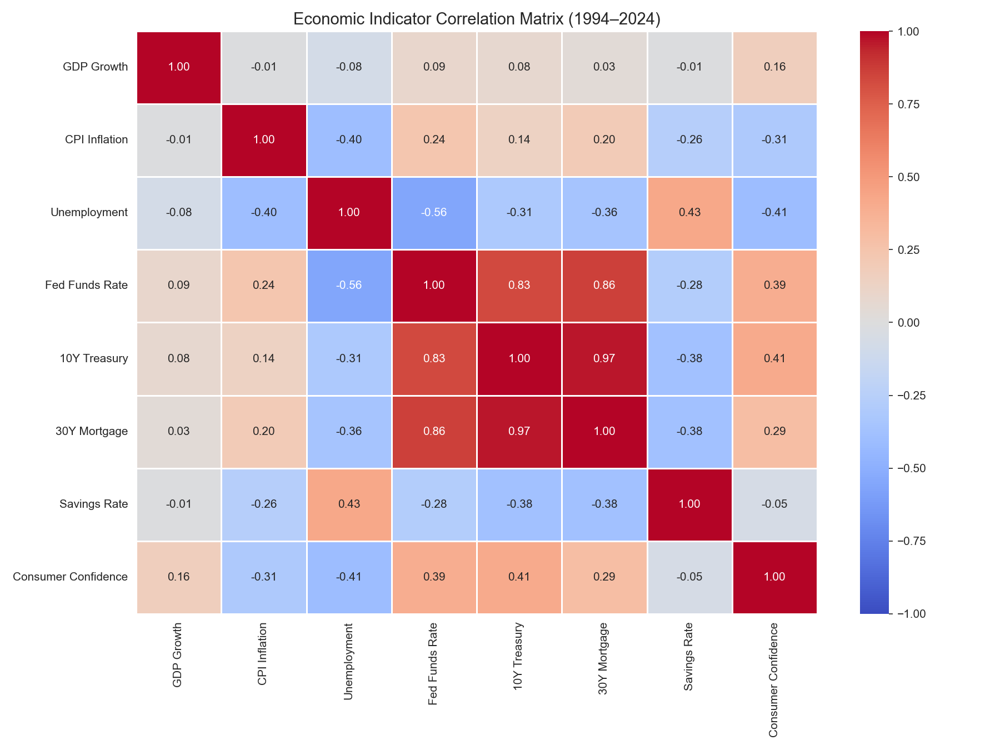
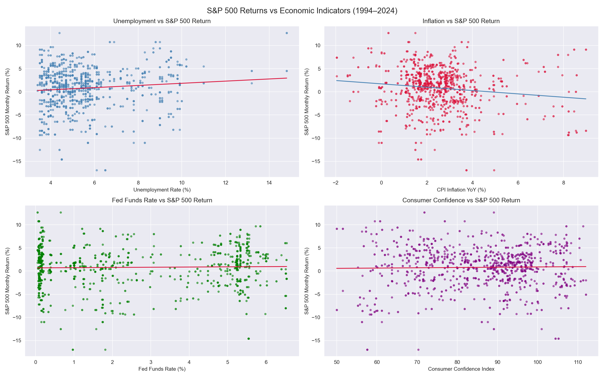
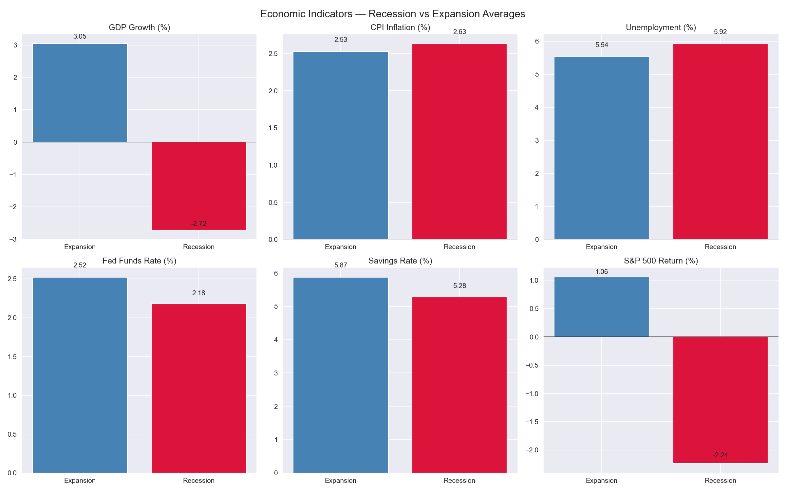

# Economic Indicators Analysis — U.S. Macroeconomic Trends

A Python analysis of 30 years of U.S. macroeconomic data (1995–2024) using the Federal Reserve Economic Data (FRED) API, examining GDP growth, inflation, unemployment, interest rates, yield curve dynamics, and the relationship between economic conditions and S&P 500 performance.

---

## Problem Statement
Macroeconomic indicators are the foundation of financial decision-making at every level — from Federal Reserve policy to corporate capital allocation to individual investment strategy. This project analyzes key U.S. economic indicators to answer:
- How have GDP growth, inflation, unemployment, and interest rates evolved over three decades?
- How do these indicators behave during recession periods?
- What is the relationship between macroeconomic conditions and S&P 500 market performance?
- How strongly are these indicators correlated with each other?

---

## Data Source
- **Provider:** Federal Reserve Economic Data (FRED) API
- **Supplemental:** Yahoo Finance via yfinance (S&P 500)
- **Period:** January 1995 – December 2024
- **Indicators:**
  - GDP Growth Rate (A191RL1Q225SBEA)
  - CPI Inflation YoY (CPIAUCSL)
  - Unemployment Rate (UNRATE)
  - Federal Funds Rate (FEDFUNDS)
  - 10-Year Treasury Yield (GS10)
  - 30-Year Fixed Mortgage Rate (MORTGAGE30US)
  - Personal Savings Rate (PSAVERT)
  - Consumer Confidence Index (UMCSENT)
- No CSV download required — all data pulls automatically via API

---

## Tools & Libraries
- Python 3.x
- Pandas, NumPy
- Matplotlib, Seaborn
- fredapi
- yfinance

---

## Setup Requirements
You will need a free FRED API key to run this project:
1. Create a free account at [fred.stlouisfed.org](https://fred.stlouisfed.org)
2. Go to **My Account** → **API Keys** → **Request API Key**
3. Replace `YOUR_FRED_API_KEY` in the notebook with your key

---

## Project Workflow
1. Data retrieval — pulled 8 macroeconomic indicators from FRED API and S&P 500 price data from Yahoo Finance
2. Data preparation — aligned quarterly GDP to monthly frequency via linear interpolation, combined all indicators into a unified DataFrame
3. Recession period annotation — marked NBER recession periods (2001, 2007-2009, 2020) for visual overlay
4. Indicator analysis — GDP growth, inflation, unemployment, interest rate, and yield curve trend analysis
5. Correlation analysis — inter-indicator correlation matrix and S&P 500 return correlations
6. Recession vs expansion comparison — average indicator values across economic regimes

---

## Key Findings
- GDP averaged **2.59% growth** over 30 years with extreme COVID-driven swings — worst quarter **-28.00%** and best quarter **+34.90%** both occurring in 2020, reflecting policy-induced shutdown and reopening rather than a traditional cycle
- CPI inflation averaged **2.54%** but spent **62.7% of months above the Fed's 2% target**, peaking at **8.98%** during the 2021-2023 post-COVID supply chain disruption
- The yield curve inverted in **356 months** across the 30-year period and preceded all 3 recessions with a perfect track record — most inverted at **-1.49%** ahead of the 2007-2009 Great Financial Crisis
- **10Y Treasury and 30Y Mortgage rates showed 0.97 correlation** — nearly perfect transmission of Fed policy into mortgage borrowing costs, the core mechanism of monetary policy transmission to the real economy
- **Fed Funds Rate and Unemployment showed -0.56 correlation** — capturing the Federal Reserve's dual mandate in action, raising rates when unemployment is low and cutting when it rises
- During recessions, S&P 500 monthly returns averaged **-2.24%** vs **+1.06%** during expansions, while Consumer Confidence fell from **86.77 to 73.28**
- **CPI inflation showed the strongest negative correlation with S&P 500 returns (-0.13)** — consistent with inflation eroding real earnings and prompting Fed tightening that pressures equity valuations
- Savings rate fell during recessions (5.87% → 5.28%), confirming that income loss forces households to draw down savings rather than accumulate them — a counterintuitive but well-documented recession dynamic

---

## Visualizations

### Indicators Overview

### GDP Growth Analysis

### Inflation Analysis

### Unemployment Analysis

### Interest Rate Analysis

### Correlation Heatmap

### S&P 500 vs Economic Indicators

### Recession vs Expansion Comparison

---

## Limitations & Next Steps
- GDP data is quarterly and was interpolated to monthly frequency — smooths true quarterly volatility
- FRED data reflects revised historical figures — real-time data available to decision-makers differed at the time
- Correlation captures linear relationships only — macroeconomic dynamics involve complex nonlinear feedback loops
- Future work: recession prediction model using leading indicators, VAR model for dynamic relationships, international comparison, Power BI real-time dashboard, lagged correlation analysis with S&P 500

---

## How to Run This Project
1. Clone the repository
2. Create a free FRED API key at [fred.stlouisfed.org](https://fred.stlouisfed.org)
3. Install Python dependencies: `pip install pandas numpy matplotlib seaborn fredapi yfinance`
4. Open `economic_analysis.ipynb` in Jupyter or VS Code
5. Replace `YOUR_FRED_API_KEY` with your actual API key
6. Run all cells — all data pulls automatically from FRED and Yahoo Finance APIs

---

## Repository Structure

---

## Author
**Mihrimah Qozat**
[LinkedIn](https://linkedin.com/in/mihrimah-qozat) |
[GitHub](https://github.com/mihrimahqozat)
